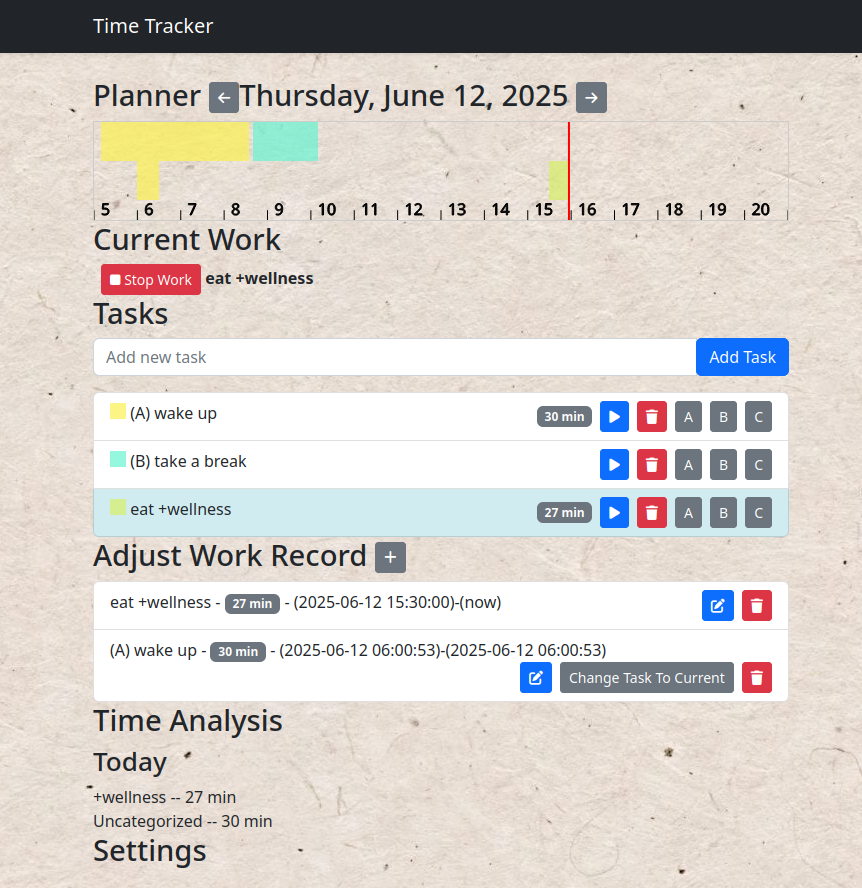

# Summary
A simple time-tracking application for your browser that persists to local storage or optionally webdav (with CORS-enabled).

It's one editable file (with CDN dependencies)!  While this isn't great for performance, I personally really like that anyone can downlod the file, run it, and edit/tweak it, without any sort of special developer setup or build tooling.  Of course, there is the service worker and manifest, but those aren't vital, and it doesn't seem like there is a way to embed these in the file.
